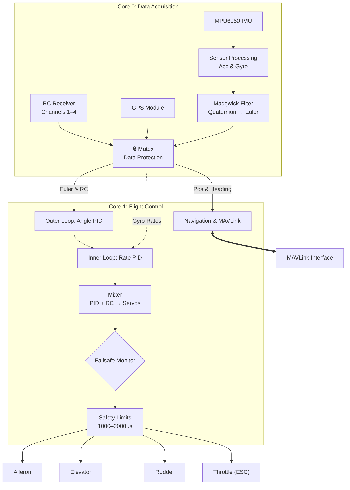

# ✈️ AeroPico FC : Fixed-Wing Flight Controller

**AeroPico FC** is an open-source flight controller firmware for fixed-wing UAVs, built on the **RP2040 (Raspberry Pi Pico)**. It uses the chip's dual-core architecture to keep sensor fusion and flight control on separate cores — the same separation professional autopilots rely on, now accessible to everyone. 🚀

Whether you are a hobbyist building your first fixed-wing or a developer researching custom autopilot stacks, AeroPico FC gives you a clean, readable codebase you can actually understand and extend. 🛠️

> ⚠️ **Note:** This project is currently in the **prototype phase** and is intended for educational and experimental use. It is not certified for commercial or safety-critical applications.

---

## 💡 Why AeroPico FC?

Most hobby-grade firmware is a black box. AeroPico FC is written to be readable first — every module has a single responsibility, every design decision is traceable in the code. You can start by tuning PID gains in `config.h` without touching anything else, and work your way down to the sensor fusion math when you are ready. 🧠

At the same time, the architecture does not cut corners. Dual-core task isolation, mutex-protected cross-core data sharing, a cascaded PID structure, and a hardware abstraction layer are patterns borrowed from professional embedded systems — not academic exercises. 💻

---

## ⚙️ Key Features

* ** Dual-core isolation** — Core 0 handles sensor reading and RC input; Core 1 runs the PID loop and drives servo outputs. They never block each other.
* ** Cascaded PID** — Outer angle loop feeds a target rate into the inner rate loop, giving smoother and more precise attitude control than a single-loop approach.
* ** Madgwick filter** — Efficient quaternion-based attitude estimation that works well even on resource-constrained hardware.
* ** MAVLink ready** — Telemetry layer is structured for MAVLink integration with any standard GCS.
* ** MPU6050 & GY-87 support** — Works with both a basic IMU and a 9-DOF module (with magnetometer).
* ** Configurable** — Pins, PID constants, RC ranges, and loop frequency are all in one place: `config.h`.

---

## 🏗 System Architecture

## 🛠 Hardware Pinout
| Function | Pin | Type | Description |
| :--- | :--- | :--- | :--- |
| **SDA (I2C)** | GP4 | I/O | Sensor Communication (SDA) |
| **SCL (I2C)** | GP5 | I/O | Sensor Communication (SCL) |
| **SBUS (RX)** | GP6 | Input | RC Receiver Signal Input |
| **AILERON** | GP16 | PWM | Aileron Servo |
| **ELEVATOR** | GP17 | PWM | Elevator Servo |
| **RUDDER** | GP18 | PWM | Rudder Servo |
| **THROTTLE** | GP19 | PWM | Motor / ESC Control |
| **Batt Monitor**| GP26 | ADC | Battery Voltage Monitoring |
| **UART0 TX** | GP0 | UART | Telemetry / GPS |
| **UART0 RX** | GP1 | UART | Telemetry / GPS |
---

## 📂 Project Structure

| Module | Description |
| --- | --- |
| `src/main.cpp` |  Entry point, `setup()` and `loop()` |
| `src/config.h` | Pins, PID gains, RC parameters — start here |
| `src/core/` |  Flight manager, Madgwick filter, PID, mixer |
| `src/drivers/` |  Hardware abstraction: MPU6050, PWM, RC |
| `src/telemetry/` |  MAVLink communication layer |
| `src/utils/` |  Logger, math helpers |

---

## 📊 Performance

| Parameter | Value |
| --- | --- |
| ⏱ Control loop frequency | 500 Hz |
| 🛡 Cross-core data sharing | Mutex-protected |
| 🧭 Attitude estimation | Madgwick |
| ⚡ PWM output range | 1000–2000 µs |

---

## 🗺 Roadmap

| Feature | Status |
| --- | --- |
| Basic flight control loop | ✅ |
| PWM RC input | ✅ |
| MPU6050 + GY-87 support | ✅ |
| Mutex-protected dual-core sharing | ✅ |
| MAVLink telemetry | ⏳ |
| Failsafe & signal-loss handling | ⏳ |
| WiFi / LoRa telemetry (Pico W) | 📅 |
| GCS with tracking antenna | 📅 |

---

## 🛠 How to Build

1. **Clone** this repository.
2. Open the project in **PlatformIO** (VS Code).
3. Verify `platformio.ini` targets the `earlephilhower` RP2040 core.
4. Run **Build**.
5. Copy the generated `firmware.uf2` to your Pico in **BOOTSEL** mode. 🚀

---

## 🤝 Contribute

Issues and pull requests are welcome. If you are new to embedded systems and want to understand how a flight controller works from the ground up, this codebase is a good place to start — open an issue and ask questions freely! 💡

---

*Developed by Muhammed Fatih Emre Özçelik* *Copyright © 2026 Muhammed Fatih Emre Özçelik. All rights reserved.*
