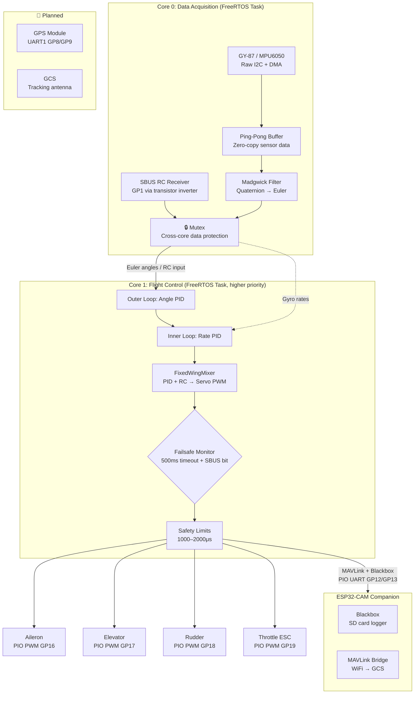

  

## ✈️ AeroPico FC : Fixed-Wing Flight Controller

## ⚠️ Intellectual Property Notice
**Copyright © 2026 Muhammed Fatih Emre Özçelik. All Rights Reserved.**

This project is **proprietary software**. The source code is provided for educational, non-commercial study, and evaluation purposes only. Any commercial use, redistribution, modification, or inclusion of this code in other software/products is **strictly prohibited** without explicit written permission from the author. 

*For commercial licensing inquiries, please contact: fatihemreozccelik@gmail.com

**AeroPico FC** is an open-source flight controller firmware for fixed-wing UAVs, built on the **RP2040 (Raspberry Pi Pico)**. It uses the chip's dual-core architecture to keep sensor fusion and flight control on separate cores — the same separation professional autopilots rely on, now accessible to everyone. 🚀

Whether you are a hobbyist building your first fixed-wing or a developer researching custom autopilot stacks, AeroPico FC gives you a clean, readable codebase you can actually understand and extend. 🛠️

> ⚠️ **Note:** This project is currently in the **prototype phase** and is intended for educational and experimental use. It is not certified for commercial or safety-critical applications.

---

## 💡 Why AeroPico FC?

Most hobby-grade firmware is a black box. AeroPico FC is written to be readable first — every module has a single responsibility, every design decision is traceable in the code. You can start by tuning PID gains in `config.h` without touching anything else, and work your way down to the sensor fusion math when you are ready. 🧠

At the same time, the architecture does not cut corners. FreeRTOS task isolation, mutex-protected cross-core data sharing, hardware-accelerated I/O via PIO and DMA, a cascaded PID structure, and a hardware abstraction layer are patterns borrowed from professional embedded systems — not academic exercises. 💻

---

## ⚙️ Key Features

* **FreeRTOS dual-core isolation** — Sensor reading and RC input run as a dedicated task on Core 0; PID loop and servo output run on Core 1 with higher priority. They never block each other.
* **Cascaded PID** — Outer angle loop feeds a target rate into the inner rate loop, giving smoother and more precise attitude control than a single-loop approach.
* **Madgwick filter** — Efficient quaternion-based attitude estimation that works well even on resource-constrained hardware.
* **PIO-based hardware PWM** — Servo signals are generated by RP2040's Programmable I/O state machines, eliminating jitter entirely without consuming CPU cycles.
* **DMA sensor reads** — MPU6050 is read via raw I2C + DMA. The CPU does not wait for sensor data; it picks up the result from a ping-pong buffer when the transfer completes.
* **MAVLink over PIO UART** — Full MAVLink v2 parser and sender running over a software UART implemented in PIO, keeping hardware UART ports free for GPS and RC receiver.
* **RC Failsafe** — Automatic failsafe on signal loss: throttle cuts, control surfaces return to neutral. Triggered by SBUS failsafe bit or 500 ms timeout.
* **Watchdog timer** — Hardware watchdog resets the system if the flight loop stalls for more than 2 seconds.
* **Blackbox logger** — Flight data is streamed over PIO UART to an ESP32-CAM companion, which writes timestamped logs to SD card.
* **MPU6050 & GY-87 support** — Works with both a basic IMU and a 9-DOF module (with magnetometer and barometer).
* **Configurable** — Pins, PID constants, RC ranges, failsafe thresholds, and loop frequency are all in one place: `config.h`.

---

## 🏗 System Architecture

---

## 🛠 Hardware Pinout

| Function | Pin | Type | Description |
| :--- | :--- | :--- | :--- |
| **SDA (I2C)** | GP4 | I/O | GY-87 sensor communication |
| **SCL (I2C)** | GP5 | I/O | GY-87 sensor communication |
| **SBUS RX** | GP1 | UART2 RX | RC receiver (transistor inverter required) |
| **ESP32-CAM TX** | GP12 | PIO UART TX | MAVLink + Blackbox to ESP32-CAM |
| **ESP32-CAM RX** | GP13 | PIO UART RX | MAVLink commands from ESP32-CAM |
| **GPS TX** | GP8 | UART1 TX | GPS module (planned) |
| **GPS RX** | GP9 | UART1 RX | GPS module (planned) |
| **AILERON** | GP16 | PIO PWM | Aileron servo |
| **ELEVATOR** | GP17 | PIO PWM | Elevator servo |
| **RUDDER** | GP18 | PIO PWM | Rudder servo |
| **THROTTLE** | GP19 | PIO PWM | Motor / ESC control |

---

## 📂 Project Structure

| Module | Description |
| --- | --- |
| `src/main.cpp` | Entry point, FreeRTOS task creation |
| `src/config.h` | Pins, PID gains, RC parameters — start here |
| `src/core/` | Flight manager, Madgwick filter, PID, mixer |
| `src/drivers/` | MPU6050 (raw I2C+DMA), PIO PWM, PIO UART, RC |
| `src/telemetry/` | MAVLink v2 parser/sender, Blackbox logger |
| `src/utils/` | Logger, math helpers |

---

## 📊 Performance

| Parameter | Value |
| --- | --- |
| ⏱ Control loop frequency | 500 Hz (FreeRTOS task) |
| 🛡 Cross-core data sharing | Mutex-protected ping-pong buffer |
| 🧭 Attitude estimation | Madgwick (quaternion) |
| ⚡ PWM output | PIO state machine, jitter-free |
| 📡 Sensor read | Raw I2C + DMA, CPU not blocked |
| 🐕 Watchdog timeout | 2000 ms hardware reset |
| ⚠️ RC failsafe timeout | 500 ms |

---
## 🚀 Optional & Companion Features
The **AeroPico Flight Controller** is designed as a core system that can be expanded with modular companion hardware. These features are **optional** and not required for the basic flight operation.

### Modular Expansion Modules
* **ESP32-CAM (Companion):** Provides remote camera streaming and enhanced WiFi telemetry. Found in the `companion/` directory.
* **GPS Integration:** Supports external GPS modules via UART. The firmware includes a pre-configured MAVLink parser to process GPS location data (GPRMC/GPGGA) if connected.
    * *Note: Requires assigning an available UART port in the configuration.*

### Modularity Philosophy
The core firmware (located in `firmware/`) is strictly optimized for flight stability using the RP2040’s real-time capabilities. Companion modules and external sensors are treated as independent data sources:
1. **Pico (FC)** handles all high-priority flight loops.
2. **Companion Modules** operate as separate entities, communicating asynchronously to prevent any interference with flight-critical tasks.

> **Plug-and-Play:** You can deploy the core flight firmware today and add GPS or camera streaming modules later without modifying the core control logic.

## 🗺 Roadmap

| Feature | Status |
| --- | --- |
| Basic flight control loop | ✅ |
| Mutex-protected dual-core sharing | ✅ |
| FreeRTOS task isolation | ✅ |
| PIO hardware PWM (jitter-free servos) | ✅ |
| Raw I2C + DMA sensor reads | ✅ |
| RC Failsafe & signal-loss handling | ✅ |
| Watchdog timer | ✅ |
| MAVLink v2 over PIO UART | ✅ |
| Blackbox logger (ESP32-CAM SD card) | ✅ |
| MPU6050 + GY-87 support | ✅ |
| ESP32-CAM integration (WiFi + camera) | ⏳ |
| GPS navigation | 📅 |
| GCS with tracking antenna | 📅 |

---
> ⚠️ **Note:** The current code contains non-essential ESP and telemetry components; if you don't need them, you can review and delete the telemetry folder. Also, check the config.h file for PIN configurations.
 ---
## 🛠 How to Build
1. **Clone** this repository.
2. Open the project in **PlatformIO** (VS Code).
3. Verify `platformio.ini` targets the `earlephilhower` RP2040 core.
4. Run **Build**.
5. Copy the generated `firmware.uf2` to your Pico in **BOOTSEL** mode. 🚀

---

## 🤝 Contribute

Issues and pull requests are welcome. If you are new to embedded systems and want to understand how a flight controller works from the ground up, this codebase is a good place to start — open an issue and ask questions freely! 💡

---

*Developed by Muhammed Fatih Emre Özçelik*
*Copyright © 2026 Muhammed Fatih Emre Özçelik. All rights reserved.*
