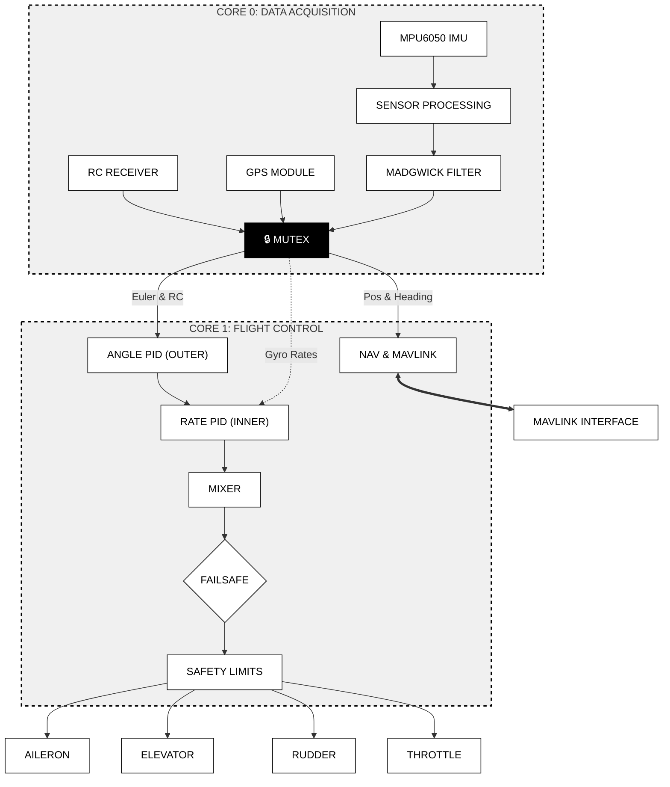

# AeroPico FC: Raspberry Pi Pico Fixed-Wing Flight Controller

**AeroPico FC** is a modular, lightweight flight controller software designed for fixed-wing aircraft, leveraging the power of the **Raspberry Pi Pico**. It provides a customizable, low-cost flight control solution for hobbyists and researchers.

> **Note:** This project is currently in the **prototype phase**. It is intended for educational and experimental purposes and should not be used in critical industrial or commercial applications.

---

### 🏗 System Architecture

The software follows a modular design to separate low-level hardware abstraction from high-level flight logic.

### 📂 Project Structure

| Module | Description |
| --- | --- |
| `src/main.cpp` | Entry point managing the `setup()` and `loop()` control cycles. |
| `src/config.h` | Central configuration for pins, PID constants, and RC parameters. |
| `src/core/` | Flight management, Madgwick sensor fusion, and PID controller loops. |
| `src/drivers/` | Hardware abstraction layers (MPU6050, GY-87, SBUS, PWM). |
| `src/telemetry/` | MAVLink-based communication protocols for GCS integration. |
| `src/utils/` | Logger and mathematical helper functions. |

---

### 🚀 Roadmap

| Feature | Status |
| --- | --- |
| Basic Flight Control Loop | ✅ Completed |
| SBUS RC Input | ✅ Completed |
| MPU6050 + GY-87 Support | ✅ Completed |
| MAVLink Telemetry | ⏳ In Progress |
| Failsafe & Error Tolerance | ⏳ In Progress |
| GCS Integration | 📅 Planned |

---

### 🛠 How to Build

1. **Clone** this repository.
2. Open the project in **PlatformIO** (VS Code).
3. Ensure your `platformio.ini` is configured for the `earlephilhower` core.
4. Run the **Build** command.
5. Copy the generated `firmware.uf2` file to your Raspberry Pi Pico in **BOOTSEL** mode.

---

### 💡 Contribute

I welcome contributions! If you have suggestions, bug reports, or feature requests, feel free to **open an Issue** or submit a **Pull Request**.

*Developed by Muhammed Fatih Emre Özçelik*
*Copyright © 2026 Muhammed Fatih Emre Özçelik. All rights reserved.*

---

